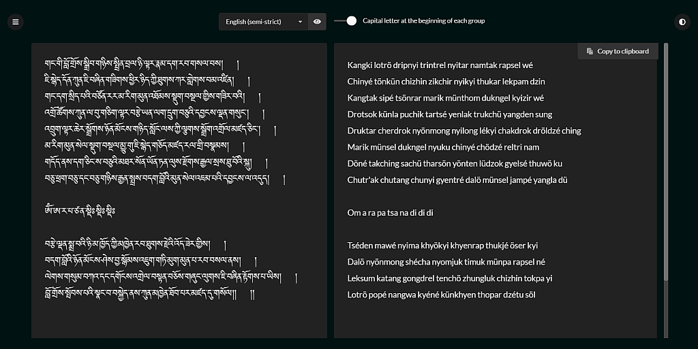

# tibetan-transliterator

A naive attempt at automatically generating reliable Tibetan transliterations
based on customizable sets of rules.

Getting started
-----------

Just copy the repository locally.

Usage
-----------

### As a library

```js
new TibetanTransliterator('གང་གི་བློ་གྲོས་').transliterate();
=> 'kangki lotrö' // using default language: 'english (strict)'
=> 'kangki lotreu'

# Use the 'capitalize' option to capitalize the first letter of every group

new TibetanTransliterator( 'ཨེ་མ་ཧོཿ སྤྲོས་བྲལ་ཆོས་ཀྱི་དབྱིངས་ཀྱི་ཞིང་ཁམས་སུ༔ ', { capitalize: true }).transliterate();
=> 'Émaho Trötrel chökyi yingkyi zhingkham su'

# Use the 'language' option to choose which set of rules you wish to follow:

new TibetanTransliterator('གང་གི་བློ་གྲོས་', { language: 'english (loose)' }).transliterate();
=> 'gangi lodrö'

new TibetanTransliterator('གང་གི་བློ་གྲོས་', { language: 'french (strict)' }).transliterate();
=> 'kangki lotreu'

# Or set the language once and for all instead of every transliteration:

TibetanTransliteratorSettings.change('french (strict)');
new TibetanTransliterator('གང་གི་བློ་གྲོས་').transliterate();
```

### As a tool

#### `index.html`



* Choose your prefered transliteration style at the top
* Paste your Tibetan in the left box
* Click *Copy to clipboard* at the top of the right box to copy the
  transliteration

#### `compare.html`


* Choose your prefered transliteration style at the top
* Paste your Tibetan in the left box
* Paste your existing transliteration in the middle box
* See the differences in the right box
* Clicking on a difference will make the necessary change in the existing
  transliteration so that it will disappear from the right box, allowing you
  to quickly prune those that are irrelevant to you.

Rule sets
-----------

All rule sets are defined in `settings/`.

The `original.js` set is not meant to be edited and serves as the default upon
which all other sets are applied to override the default rules.

For instance the rule for 'kha' in `original.js` is:
```js
'kha': 'kh',
```

If you wish to display 'kha' as 'ka', you would have this line in your own
rule set file:
```js
'kha': 'k',
```

Every single line in `original.js` can thus be copy-pasted in another set file
to be overridden. You can edit existing rule sets or create new ones.

To add a new one just copy an existing one and replace twice the name of the
set:
```html
# settings/my-new-set.js

settingsPerLanguage['my new set'] = {
...
}

exceptionsPerLanguage['my new set'] = {
...
}
```
Also don't forget to add the `<script>` include tag in `index.html`,
`compare.html` and `tests.html` next to the other ones:
```html
<script src="settings/my-new-set.js"></script>
```

Testing
-----------


Just open `tests.html`.

Categories can be clicked to reveal their test cases.

To ease debugging, clicking a Tibetan case on the right side will re-run the
test for just that particular case.

TODO
-----------

See `TODO.md`

Credits
-----------

The rules used to deconstruct the syllables into parts (root, prefix, ...)
are almost entirely based on John Rockwell's ZALKEJZAMLEKJZA

License
-----------

This software is licensed under the MIT License.

Copyright Padmakara, 2021.

Permission is hereby granted, free of charge, to any person obtaining a
copy of this software and associated documentation files (the
"Software"), to deal in the Software without restriction, including
without limitation the rights to use, copy, modify, merge, publish,
distribute, sublicense, and/or sell copies of the Software, and to permit
persons to whom the Software is furnished to do so, subject to the
following conditions:

The above copyright notice and this permission notice shall be included
in all copies or substantial portions of the Software.

THE SOFTWARE IS PROVIDED "AS IS", WITHOUT WARRANTY OF ANY KIND, EXPRESS
OR IMPLIED, INCLUDING BUT NOT LIMITED TO THE WARRANTIES OF
MERCHANTABILITY, FITNESS FOR A PARTICULAR PURPOSE AND NONINFRINGEMENT. IN
NO EVENT SHALL THE AUTHORS OR COPYRIGHT HOLDERS BE LIABLE FOR ANY CLAIM,
DAMAGES OR OTHER LIABILITY, WHETHER IN AN ACTION OF CONTRACT, TORT OR
OTHERWISE, ARISING FROM, OUT OF OR IN CONNECTION WITH THE SOFTWARE OR THE
USE OR OTHER DEALINGS IN THE SOFTWARE.
