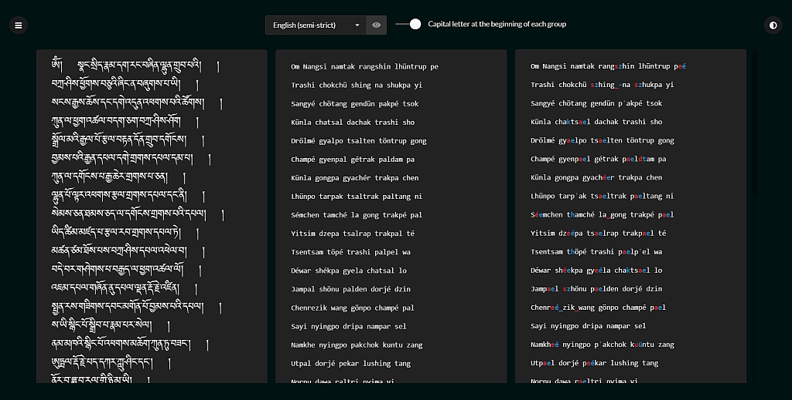
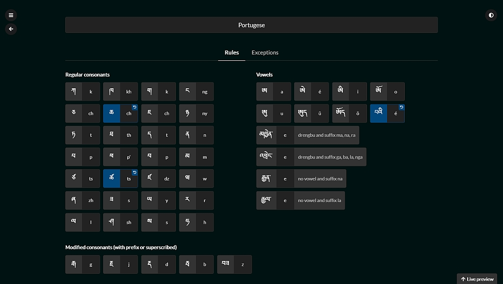

# tibetan-transliterator

A naive attempt at automatically generating reliable Tibetan transliterations
based on customizable sets of rules.

Getting started
-----------

Just copy the repository locally.

Usage
-----------


* Choose your prefered transliteration setting at the top
* Paste your Tibetan in the left box
* Click *Copy to clipboard* at the top of the right box to copy the
  transliteration

#### Compare page



* Choose your prefered transliteration setting at the top
* Paste your Tibetan in the left box
* Paste your existing transliteration in the middle box
* See the differences in the right box
  * In red are the things that are present in the existing but missing from the auto-generated.
  * In blue are the things that are present in the auto-generated but missing from the existing.
* Clicking on a difference will make the necessary change in the existing
  transliteration so that it will disappear from the right box, allowing you
  to quickly prune those that are irrelevant to you.

### Using as a library

```js
var transliterator = new TibetanTransliterator(); // using default 'english-strict'
transliterator.transliterate('གང་གི་བློ་གྲོས་');
// => 'kangki lotrö'
transliterator.transliterate('སྒྲིབ་གཉིས་སྤྲིན་བྲལ་');
// => 'dripnyi trintrel'
```
Use the `capitalize` option to capitalize the first letter of every group,
either passing it to the constructor:
```js
var transliterator = new TibetanTransliterator({ capitalize: true });
transliterator.transliterate('ཨེ་མ་ཧོཿ སྤྲོས་བྲལ་ཆོས་ཀྱི་དབྱིངས་ཀྱི་ཞིང་ཁམས་སུ༔ ');
// => 'Émaho Trötrel chökyi yingkyi zhingkham su'
transliterator.transliterate('གང་གི་བློ་གྲོས་');
// => 'Kangki lotrö'
```
Or on a per-call basis:
```js
var transliterator = new TibetanTransliterator();
transliterator.transliterate('ཨེ་མ་ཧོཿ སྤྲོས་བྲལ་ཆོས་ཀྱི་དབྱིངས་ཀྱི་ཞིང་ཁམས་སུ༔ ', { capitalize: true });
// => 'Émaho Trötrel chökyi yingkyi zhingkham su'
transliterator.transliterate('ཨེ་མ་ཧོཿ སྤྲོས་བྲལ་ཆོས་ཀྱི་དབྱིངས་ཀྱི་ཞིང་ཁམས་སུ༔ ');
// => 'émaho trötrel chökyi yingkyi zhingkham su'
```
Use different settings, either by passing the name of an existing setting:
```js
new TibetanTransliterator({ setting: 'english-loose' }).transliterate('གང་གི་བློ་གྲོས་');
// => 'gangi lodrö'

```
Or the setting itself:
```js
var frenchRuletset = Settings.find('french');
new TibetanTransliterator({ setting: frenchRuletset }).transliterate('གང་གི་བློ་གྲོས་');
// => 'kangki lotreu'
```
Or any object that quacks like a setting, meaning it returns objects for `rules` and `exceptions`:
```js
var dummyRuleSet = {
  rules: { 'ö': 'eu' },
  exceptions: {}
};
new TibetanTransliterator({ setting: dummyRuleSet }).transliterate('གང་གི་བློ་གྲོས་');
// => 'kangki lotreu'
```

Settings
-----------




See how are defined the default settings, copy them or create your own.

English (strict) is the setting that defines the default rules. Any rule in
any other setting that is different from its default value will be highlighted
in color, and a small button allows to revert back to the default value.

### Editing and creating default settings

The default settings are defined in `settings/`, feel free to modify them to
your needs, but `default.js` and `english-strict.js` are not meant to be edited
since they form the basis upon which all other sets are built.

Rules are defined as key-value pairs, the left-hand side being the internal
code used by the app, the right-hand side what you want it to be substituted
with in the generated transliteration.

For instance the rule for "kha" (2nd column "ka") in `default.js` is:
```js
'kha': 'kh',
```

If you wish to display "kha" as "ka", you would have this line in any of the
other setting files:
```js
'kha': 'k',
```
Which will take precedence over the default value (that will be ignored).

Every single line in `default.js` can thus be copy-pasted in another set file
to be overridden. You can edit existing rule sets or create new ones.

To add a new rule set just copy an existing one and replace the `id` and
`name`, making sure your new `id` has not already been taken.
```html
# settings/my-new-set.js

defaultSettings.push({

  id: 'my-new-set',
  name: 'My new set',

  rules: {
    ...
  },

  exceptions: {
    ...
  }

})
```

Also don't forget to add the `<script>` include tag in `index.html` next to
the other ones:
```html
<script src="settings/my-new-set.js"></script>
```

Exceptions
-----------


Define here exceptions that will apply to all settings. Basically the left-hand
side value will be substituted by the right-hand side value, and every Tibetan
part in the right-hand side value will be itself transliterated.

### Editing default exceptions


General exceptions apply to all different settings and are found in
`settings/exceptions.js`

Setting-specific exceptions can also be defined. Just add the specific
exceptions in the `exceptions` attribute of any setting. If the left-hand side
value is the same as one of the general exceptions, it will take precedence
over the general exception.

Fonts
-----------

The app is designed to use these fonts in order of preference:
```
* TibetanChogyalUnicode-170221 if it is installed on the user system
* TibetanChogyalUnicode-ID     if it is installed on the user system
* TibetanChogyalUnicode        if it is installed on the user system
* TibetanMachineUnicode        if none of the previous ones are installed. It is included in the app.
```

Since I believe `TibetanChogyalUnicode` is copyrighted but `TibetanMachineUnicode` is free to use, this should ensure that people with `TibetanChogyalUnicode` already installed on their machine will be able to benefit from it, and those who don’t will still have a good enough font displayed even if none are installed on their system.
You could update all the .css files in stylesheets/ with the latest version of `TibetanChogyalUnicode` if necessary, either by replacing `TibetanChogyalUnicode-170221` by the latest one:
```
font-family: TibetanChogyalUnicode-210803, TibetanChogyalUnicode-ID, TibetanChogyalUnicode, TibetanMachineUnicode !important;
```
instead of:
```
font-family: TibetanChogyalUnicode-170221, TibetanChogyalUnicode-ID, TibetanChogyalUnicode, TibetanMachineUnicode !important;
```
or by adding the latest one before `TibetanChogyalUnicode-170221` with a comma in between:
```
font-family: TibetanChogyalUnicode-210803, TibetanChogyalUnicode-170221, TibetanChogyalUnicode-ID, TibetanChogyalUnicode, TibetanMachineUnicode !important;
```

Development
-----------

Use `index_dev.html` instead of `index.html`.

This way all javascripts files are loaded from their non-transpiled version
(i.e. not the -dist.js files). This means you will see the results live even if
your transpilation system is not running.

Also you will have an extra option on the `/settings/exceptions` page allowing
you to ignore browser stored values for the general exceptions, therefore making
it easier to test the ones you are adding to the `settings/exceptions.js` file.

Contributing
------------

You are most welcome to pitch in and improve anything that doesn't feel right,
define new default settings or add more edge cases.

If it looks a bit messy to you, still don't be discouraged to give it a try,
you can always run the tests to make sure all the currently covered cases
continue to yield the expected results.

And if you do tweak the code, please add enough tests so that others after you
can rely on them too!

Testing
-----------


Just open `tests.html`.

Categories can be clicked to reveal their test cases.

To ease debugging, clicking a test case on the right side will re-run the
test for just that particular case.

TODO
-----------

See `TODO.md`

Credits
-----------

The rules used to deconstruct the syllables into parts (root, prefix, ...)
are almost entirely based on John Rockwell's *A Primer for Classical Literary
Tibetan, Volume 1*.

Much thanks to everyone involved in the publication of
this great book.

A zillion thanks also to:

* Joe B. Wilson and everybody involved in publishing *Translating Tibetan from
  Buddhism* which is equally great and provided some more clarifications.
* Tony Duff and friends for producing all these beautiful Tibetan fonts,
  software and fine translations.
* Everybody involved in building and maintaining Vue.js, SemanticUI, FontAwesome,
  SublimeText, jQuery, Sugar.js, Underscore.js, DevDocs, Zeal, Google Chrome
  and Mozilla Firefox for making web development so easy and enjoyable, even in
  an offline environment.

Through the virtue coming from this work, may all beings human and
otherwise reach absolute freedom and peace.

License
-----------

This software is licensed under the MIT License.

Copyright Padmakara, 2020-present.

Permission is hereby granted, free of charge, to any person obtaining a
copy of this software and associated documentation files (the
"Software"), to deal in the Software without restriction, including
without limitation the rights to use, copy, modify, merge, publish,
distribute, sublicense, and/or sell copies of the Software, and to permit
persons to whom the Software is furnished to do so, subject to the
following conditions:

The above copyright notice and this permission notice shall be included
in all copies or substantial portions of the Software.

THE SOFTWARE IS PROVIDED "AS IS", WITHOUT WARRANTY OF ANY KIND, EXPRESS
OR IMPLIED, INCLUDING BUT NOT LIMITED TO THE WARRANTIES OF
MERCHANTABILITY, FITNESS FOR A PARTICULAR PURPOSE AND NONINFRINGEMENT. IN
NO EVENT SHALL THE AUTHORS OR COPYRIGHT HOLDERS BE LIABLE FOR ANY CLAIM,
DAMAGES OR OTHER LIABILITY, WHETHER IN AN ACTION OF CONTRACT, TORT OR
OTHERWISE, ARISING FROM, OUT OF OR IN CONNECTION WITH THE SOFTWARE OR THE
USE OR OTHER DEALINGS IN THE SOFTWARE.
